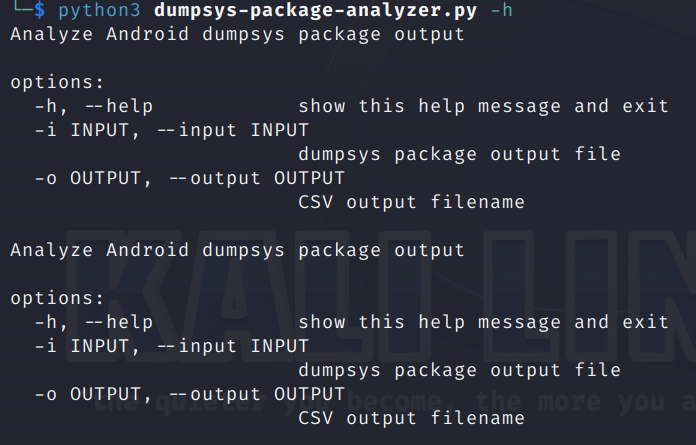
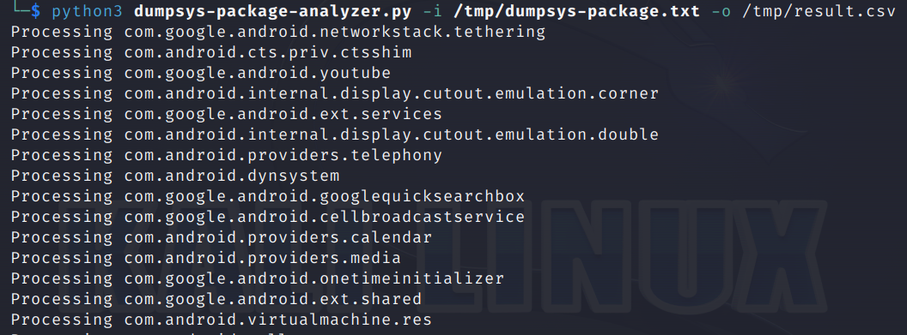
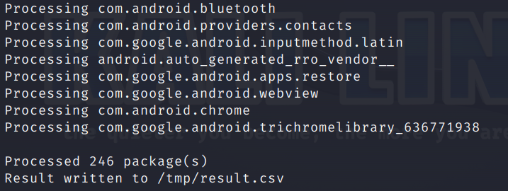
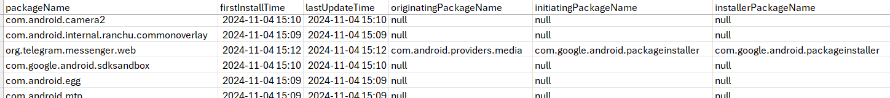

# Android Package Information Extractor

An open source forensic tool written in Python3 to get Android applications/packages information from `dumpsys package` result and store it into CSV. No root privilege is needed.  
Note: this script is tested to parse Android Emulator API 35 data

## Features

Extract the following information into a CSV file:
* firstInstallTime
* lastUpdateTime
* originatingPackageName
* initiatingPackageName
* installerPackageName

## Installation

```bash
# Clone the repository
git clone https://github.com/niko95kus/dumpsysPackageAnalyzer.git

# Navigate to the project directory
cd dumpsysPackageAnalyzer
```

## Usage

1. Enable USB debugging in the device system settings, under Developer options (you have to [enable the developer options](https://developer.android.com/studio/debug/dev-options) if you haven't done so)
2. Download adb that is bundled in [Android SDK platform tools](https://developer.android.com/tools/releases/platform-tools)
3. Get the dumpsys package data `adb shell dumpsys package > dumpsys-package.txt`
4. `python3 dumpsys-package-analyzer.py dumpsys-package.txt`

## Examples




